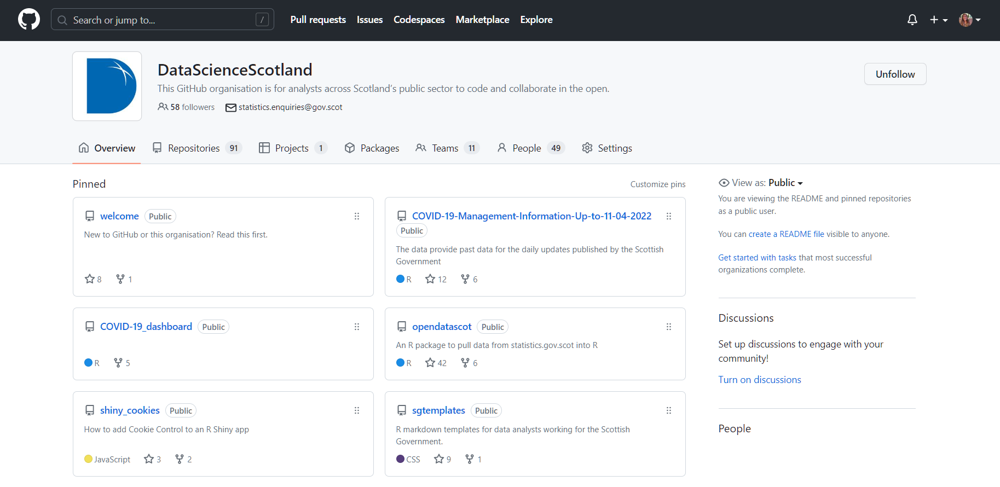

```{r save-to-pdf, include = FALSE}
pagedown::chrome_print(here::here("2023-04-27_version-control", "slides.html"))
```


## Aims

<br>

* What is version control?

* Introduction to Git and GitHub

* How Git and GitHub can be used for reproducible data analysis

* Note: This aim of this presentation is to introduce concepts and will be non-technical. If you would like technical support, please get in touch. (Contact details are at the end of the slides.)


## What is version control?

Version control is the practice of tracking and managing changes to files. 

<br>

Does this look familiar?

```
├── stats-publication
│   ├── publication-analysis-code.R
│   ├── publication-analysis-code-v2.R
│   ├── publication-analysis-code-v2 NEW METHODOLOGY.R
│   ├── publication-analysis-code-v2 NEW METHODOLOGY AB-changes.R
│   ├── publication-analysis-code-final.R
│   ├── publication-analysis-code-final April 2023.R
```


## Git <a href="https://git-scm.com/"></a>

Git is a free and open source software for version control. 

To use:

* Install Git on your computer

* Initiate Git in a project folder (also called a repository)

* Record any changes you make to files (these records are called 'commits')

* Undo changes and revert to previous version of files (if required)

* Collaborate with others on the same project using branches 

Git is used via a terminal-like tool called Git Bash, or via RStudio.


## Git <a href="https://git-scm.com/"></a>

Using Git means you don't need to save multiple copies of the same file to retain older versions. This information is stored by Git. 

Commits contain information on:

* **what** change was made,
* **when** the change was made,
* **why** the change was made, and
* **who** made the change.

Git tracks changes to the content of files, not just the file as a whole. This means the information above can be recorded for changes as small as one character on one line of code.


## What is in a code repository?

A version controlled code repository will usually contain files for one project and can contain:

* Code (e.g. R scripts)
* Documentation (e.g. README)
* Configuration files
* ...but **NOT DATA**!


Data can be stored within your code repository, but it should not be tracked by Git. To ensure data files (and any other files containing sensitive information) are not tracked, a **.gitignore** file can be used to exclude them. Alternatively, data can be stored outside of your code repository.

More information on using Git safely can be found in the [Duck Book](https://best-practice-and-impact.github.io/qa-of-code-guidance/version_control.html#avoid-commiting-sensitive-information-to-git-repositories).


## GitHub <a href="https://github.com/"></a>

GitHub is a web interface for hosting version controlled code. GitHub is owned by Microsoft but is mostly free to use, although some extra features are available for a fee. Rivals also exist, e.g. GitLab, Bitbucket.

GitHub can be used to:

* Make code publicly available (although repositories can also be private)

* Facilitate code review (using 'pull requests')

* Manage projects using tools such as issue tracking

* Navigate Git history and view previous versions of files

* View other people's code and collaborate


## GitHub Organisation <a href="https://github.com/"></a>

https://github.com/DataScienceScotland

<div style="text-align: center;"></div>


## How to use Git and GitHub

* Git can be used without GitHub

* GitHub is often used as the main copy of a code repository (or 'remote'). Analysts or developers can take a copy (or 'clone') of the repository from GitHub to work on locally.

* Use Git locally to track changes and regularly 'push' to GitHub

* Use GitHub to facilitate code review and merging of branches


## Why use Git and GitHub?

* Preferable to lots of copies of the same file with various names!

* [Reproducible Analytical Pipelines (RAP)](https://analysisfunction.civilservice.gov.uk/support/reproducible-analytical-pipelines/)

   * **Reproducible**: You can rerun your code as it was at any point in time.
   
   * **Auditable**: You have a record of when changes were made and why.
   
   * **Transparent**: Code is publicly available on GitHub and available for others to review or reuse.
   
   * **Good quality**: Code review is built into the GitHub workflow.


## Links and Resources {.smaller}

* Version control [Saltire pages](http://saltire/orgspaces/Analytic-Professions/Analytical-Tools/Pages/version-control-guide.aspx) (accessible on Scottish Government SCOTS network only)

* [Data Science Scotland](https://github.com/DataScienceScotland) GitHub Organisation

* Duck Book

   * [Version Control](https://best-practice-and-impact.github.io/qa-of-code-guidance/version_control.html)
   
   * [Using Git safely](https://best-practice-and-impact.github.io/qa-of-code-guidance/version_control.html#avoid-commiting-sensitive-information-to-git-repositories)
   
   * [GitHub features](https://best-practice-and-impact.github.io/qa-of-code-guidance/version_control.html#github)
   
* Government Analysis Function guidance on [open sourcing analytical code](https://analysisfunction.civilservice.gov.uk/policy-store/open-sourcing-analytical-code/)

* ONS Learning Hub (contact Data.Science.Campus.Faculty@ons.gov.uk to request an account)
   
   * [Command Line Basics](https://gss.civilservice.gov.uk/training/command-line-basics/)
   
   * [Introduction to Git](https://analysisfunction.civilservice.gov.uk/training/introduction-to-git/)

* [Happy Git with R](https://happygitwithr.com/)

## Contact

Alice Byers <br>
RAP Developer <br>
Data Innovation Team, Scottish Government

* Email - [alice.byers@gov.scot](mailto:alice.byers@gov.scot)

* GitHub - [alicebyers5](https://github.com/alicebyers5)